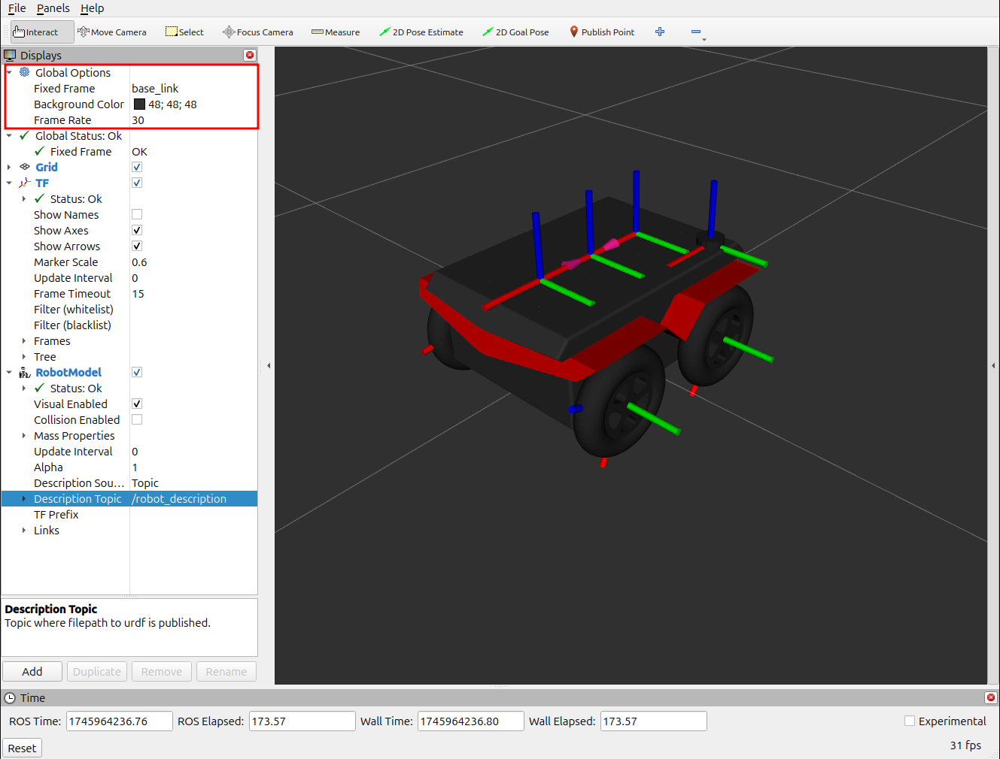
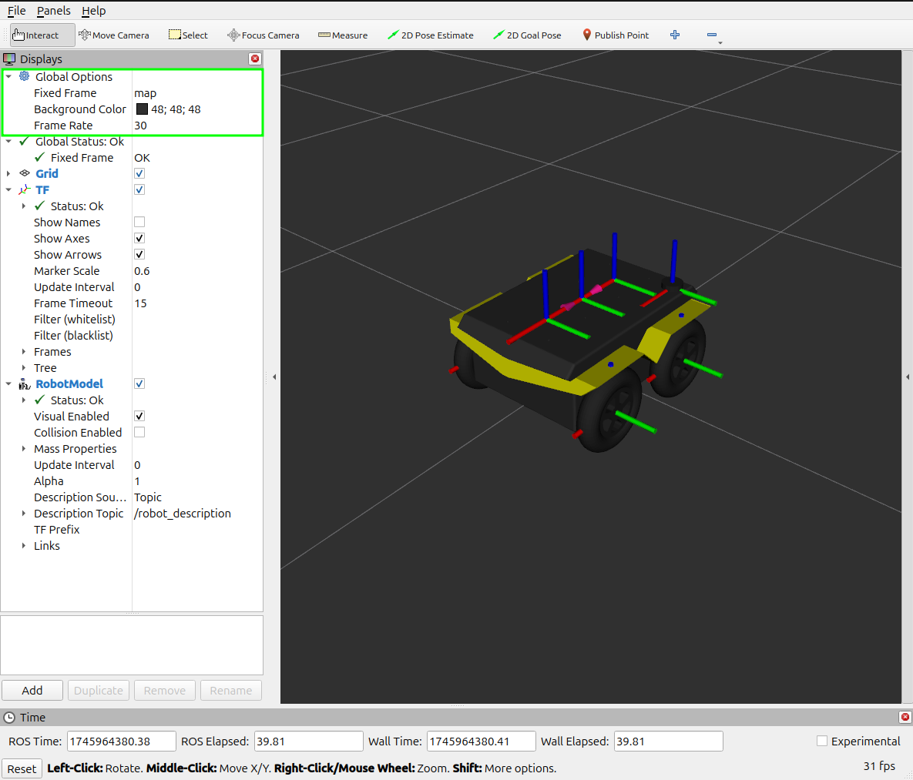

# Proyecto Final: Teleoperación y Visualización del Jackal en RViz 2

Instrucciones a seguir para el proyecto final.

## Compilacion del workspace ros2-jackal-ugv

1. Clona el repositorio `ros2-jackal-ugv` en el directorio fuente (`src`) de tu `ros2 workspace`.


2. Tu directorio tendra la siguiente estructura.
    ```shell
    ~/your-ros2-workspace/src/ros2-jackal-ugv$ tree -L 2
    .
    ├── jackal_description
    │   ├── CMakeLists.txt
    │   ├── launch
    │   ├── meshes
    │   ├── meta-information.json
    │   ├── package.xml
    │   ├── rviz
    │   └── urdf
    ├── jackal_mover
    │   ├── jackal_mover
    │   ├── package.xml
    │   ├── resource
    │   ├── setup.cfg
    │   ├── setup.py
    │   └── test
    └── ProyectoFinalDescripcion.md
    ```

3. Configurar el entorno ejecutando:
    ```
    ~/your-ros2-workspace$ source /opt/ros/jazzy/setup.bash
    ```

4. Compila los nuevos paquetes.

5. Actualiza el entorno via `set-ros`.

## Launch file

6. Añade el nodo `teleop_mover` del paquete `jackal_mover` al archivo de lanzamiento.

    Puedes hacerlo en el archivo de lanzamiento en Python:
    ```
    ~/your-ros2-workspace/src/ros2-jackal-ugv/jackal_description/launch/display.launch.py
    ```
    o en el archivo en formato XML:
    ```
    ~/your-ros2-workspace/src/ros2-jackal-ugv/jackal_description/launch/display.launch.xml
    ```

## Visualiza tu proyecto y modifica su color

7. Luego de setear el entorno en una terminal (ver pasos 3 y 5), lanza tu proyecto ejecutando el siguiente comando:
    ```
    ros2 launch jackal_description display.launch.py
    ```
    RViz se abrirá y podrás visualizar el robot Jackal.
    

8. El color del robot debe coincidir con el color mostrado por el fabricante en su página web: https://clearpathrobotics.com/jackal-small-unmanned-ground-vehicle/.

    Modifica el color en el archivo:
    ```
    ros2-jackal-ugv/jackal_description/urdf/jackal.urdf
    ```
    para que se asemeje al modelo oficial del fabricante.

    1. Para visualizar los cambios en el URDF, es necesario detener el comando del paso 7 con `Ctrl + C` y volver a ejecutarlo.

    2. **Consejo:** Revisa los colores definidos en la sección de materiales (`<material>`) del robot.
    

## Controla tu robot

9. En una nueva terminal, instala el paquete `teleop_twist_keyboard` con el siguiente comando, si aun no lo tienes instalado:
    ```
    sudo apt-get install ros-$ROS_DISTRO-teleop-twist-keyboard
    ```

10. Luego de configurar el entorno en una terminal (ver pasos 3 y 5), ejecuta el controlador con:
    ```
    ros2 run teleop_twist_keyboard teleop_twist_keyboard
    ```

    1. Si sigues las instrucciones del nodo `teleop_twist_keyboard`, podrás controlar el movimiento de tu robot usando el teclado.

    2. Recuerda seleccionar la terminal donde se está ejecutando `teleop_twist_keyboard` para que los comandos tengan efecto.

## Entregable

11. Comparte tu pantalla mostrando tu robot moviéndose:


12. Presenta la posicion en XY uilizando plotjuggler.
    1. En una nueva terminal, instala el paquete `plotjuggler` con el siguiente comando, si aun no lo tienes instalado:
    ``` 
    sudo apt install ros-$ROS_DISTRO-plotjuggler-ros
    ```
    2. Lanza plotjuggler y subscribete al topic.